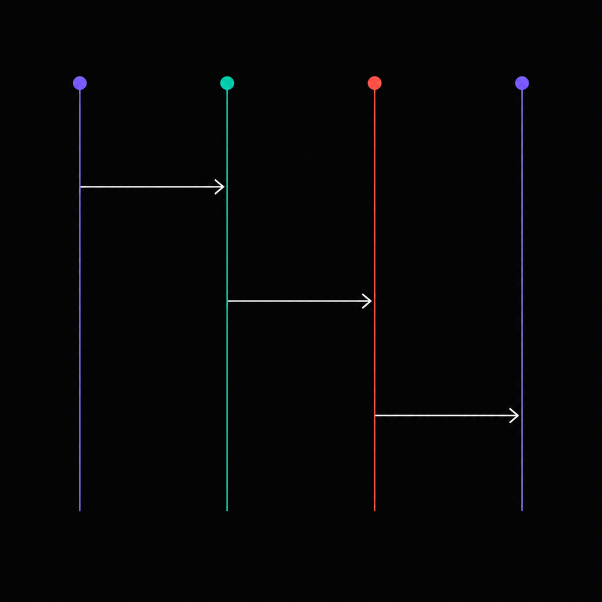

> English | [简体中文](./README.zh-CN.md)

<p align="center"></p>

<h1 align="center">Anthropify</h1>

<p align="center"><i>The Anthropic SDK, for every LLM. In Go.</i></p>

<p align="center">
<a href="https://pkg.go.dev/github.com/shahao/anthropify"></a>
<a href="https://go.dev/"></a>
<a href="./LICENSE"></a>
</p>

## What is this?

Anthropify is a Go library that lets you talk to OpenAI, Gemini, Kimi, GLM,
MiniMax, DeepSeek and other LLM providers through the Anthropic Messages API
shape. It does protocol translation, SSE streaming, tool use, thinking blocks
and `cache_control` in-process — no proxy server in front. Callers only ever
see `anthropic.MessageNewParams` and `anthropic.MessageStreamEventUnion`.

## Quick start

```go
package main

import (
    "context"
    "fmt"
    "os"

    "github.com/anthropics/anthropic-sdk-go"
    ap "github.com/shahao/anthropify"
)

func main() {
    client, err := ap.New(
        ap.WithChatCompletion("kimi", ap.OpenAICompatConfig{
            BaseURL: "https://api.moonshot.cn/v1",
            APIKey:  os.Getenv("KIMI_API_KEY"),
        }),
        ap.WithModelRoute("kimi-", ap.Route{
            Provider: ap.ProviderChatCompletions,
            Backend:  "kimi",
        }),
    )
    if err != nil {
        panic(err)
    }

    stream, err := client.CreateMessageStream(context.Background(), anthropic.MessageNewParams{
        Model:     "kimi-k2.6",
        MaxTokens: 1024,
        Messages: []anthropic.MessageParam{
            anthropic.NewUserMessage(anthropic.NewTextBlock("Hello, who are you?")),
        },
    })
    if err != nil {
        panic(err)
    }
    defer stream.Close()

    for stream.Next() {
        fmt.Printf("%+v\n", stream.Current()) // anthropic.MessageStreamEventUnion
    }
    if err := stream.Err(); err != nil {
        panic(err)
    }
}
```

Non-streaming uses the same request type and returns `*anthropic.Message`:

```go
msg, err := client.CreateMessage(ctx, req)
```

## See it in action

Anthropify's claim is that one Anthropic-canonical conversation slice can
flow through any provider mid-thread. To prove it, [example 03](./examples/03-model-hot-switching)
runs a single chat across four upstreams — Claude plans, Kimi codes, GLM
translates, Claude summarises — without ever rebuilding the message
history. The only field that changes between turns is `req.Model`.

<p align="center"></p>

```go
var messages []anthropic.MessageParam
for _, t := range turns {
    messages = append(messages, anthropic.NewUserMessage(anthropic.NewTextBlock(t.question)))
    reply, _ := runTurn(client, t.model, t.maxTokens, messages) // only Model changes
    messages = append(messages, anthropic.NewAssistantMessage(anthropic.NewTextBlock(reply)))
}
```

> See [examples/03-model-hot-switching](./examples/03-model-hot-switching) for the full runnable example.

## Why Anthropic-canonical?

Streaming protocols differ widely across vendors, and the shape you pick as
the canonical event format affects every downstream agent.

- Anthropic's stream is a small, ordered set of events with explicit content
  block boundaries: `message_start`, `content_block_start`,
  `content_block_delta`, `content_block_stop`, `message_delta`,
  `message_stop`. Text, tool use and thinking each live in their own block.
- OpenAI Chat Completions packs everything into `choices[*].delta`. Tool
  calls, reasoning, and refusals are tacked on as side fields with no
  structural separation between content kinds.
- OpenAI Responses splits the same stream into a much larger event set
  (`response.output_item.added`, `response.content_part.added`,
  `response.output_text.delta`, and so on). The extra granularity adds
  bookkeeping without making the wire shape easier to consume.

For an agent framework that needs a stable internal event vocabulary, the
Anthropic shape sits at a useful point on the granularity curve. Anthropify
adopts it as the canonical form and normalises every provider into it.

## Supported providers

| Provider          | Streaming | Non-streaming         | Tool use | Thinking          | cache_control |
|-------------------|-----------|------------------------|----------|-------------------|---------------|
| Anthropic         | yes       | native                 | yes      | yes               | top-level + per-block |
| OpenAI Responses  | yes       | drain-and-assemble     | yes      | yes (reasoning)   | server auto   |
| Azure OpenAI      | yes       | drain-and-assemble     | yes      | yes (reasoning)   | server auto   |
| Gemini Native     | yes       | drain-and-assemble     | yes      | yes               | server auto   |
| Kimi (Moonshot)   | yes       | drain-and-assemble     | yes      | yes               | server auto   |
| GLM (Zhipu)       | yes       | drain-and-assemble     | yes      | model-dependent   | server auto   |
| MiniMax           | yes       | native (anthropic)     | yes      | yes               | top-level + per-block |
| AWS Bedrock       | yes       | native (anthropic)     | yes      | yes               | top-level + per-block |
| DeepSeek          | yes       | drain-and-assemble     | yes      | yes (V3.2)        | server auto   |

> **MiniMax** speaks the Anthropic protocol natively at
> `https://api.minimax.io/anthropic/v1/messages`, so it plugs into the
> *same* in-process anthropic adapter as real Claude. Two vendors, one
> protocol, one adapter — see
> [example 07](./examples/07-anthropic-compat) for the registration
> pattern (`WithAnthropicCompat("minimax", …)` +
> `WithModelRoute("MiniMax-", …)`).

> **AWS Bedrock** is the third backend on the same Anthropic-protocol
> family. The Bedrock branch dispatches through `anthropic-sdk-go`'s
> official `bedrock` subpackage, which transparently handles SigV4
> signing, the `/model/{id}/invoke[-with-response-stream]` URL rewrite,
> the `anthropic_version: bedrock-2023-05-31` body injection, the
> `anthropic-beta` header → `anthropic_beta` body translation, and AWS
> event-stream decoding back into canonical Anthropic SSE events. From
> the caller's perspective the request and response shapes are
> identical to Direct or MiniMax. Register with `WithAnthropicBedrock`
> and route Bedrock model IDs (or inference-profile ARNs) via
> `WithModelRoute` + `Route.UpstreamModel`. See the [AWS Bedrock
> integration](#aws-bedrock-integration) section below.

> **Azure OpenAI** is the second backend on the OpenAI Responses
> protocol family. Internally rides on the same
> `adapter/openai_responses` code path as vanilla OpenAI; only URL
> composition (deployment-bound vs deployment-less, auto-picked) and
> auth headers (both `api-key` and `Authorization: Bearer` are sent
> for robustness against APIM gateways and Entra/AAD tokens) differ.
> Register with `WithAzureOpenAI` and pin a deployment via
> `AzureOpenAIConfig.Deployment` (or leave empty and let the body's
> model field carry the deployment name). See the [Azure OpenAI
> integration](#azure-openai-integration) section below.

> Anthropify recommends `gemini-3.5-flash` (or any Gemini 3.x flash
> variant). The adapter emits `thinkingLevel` in
> `generationConfig.thinkingConfig`, which the 2.5 series rejects with
> HTTP 400, so plan to use the 3.x family. Pro-series models
> (`gemini-3-pro-preview`, `gemini-3.1-pro-preview`) require explicit
> Google preview enrolment and are not assumed available out of the box.

Tested with thinking on `gemini-3.5-flash`, `gemini-3.1-pro-preview`,
`gemini-3-pro-preview`, and `gemini-pro-latest` — all four return
canonical thinking blocks with `thoughtSignature` round-trip on AI
Studio billing-enabled projects.

Only the Anthropic adapter exposes a real non-streaming endpoint. For every
other provider, `CreateMessage` opens the stream and assembles the final
`*anthropic.Message` from content blocks.

Routing is prefix-based on `req.Model`:

| Prefix              | Provider            |
|---------------------|---------------------|
| `claude-`           | `anthropic`         |
| `gpt-`, `o1-`, `o3-`| `openai_responses`  |
| `gemini-`           | `gemini_native`     |

Kimi / GLM / DeepSeek and other OpenAI-compatible upstreams are registered
with `WithChatCompletion(name, ...)` and routed via `WithModelRoute(prefix, Route{Provider: ProviderChatCompletions, Backend: name})`.

Anthropic-compatible providers (e.g. **MiniMax**) plug onto the *same*
anthropic adapter as real Claude via
`WithAnthropicCompat(name, AnthropicConfig{...})`, then route by prefix:

```go
ap.WithAnthropicCompat("minimax", ap.AnthropicConfig{
    BaseURL: "https://api.minimax.io/anthropic",
    APIKey:  os.Getenv("MINIMAX_API_KEY"),
})
ap.WithModelRoute("MiniMax-", ap.Route{
    Provider: ap.ProviderAnthropic, Backend: "minimax",
})
```

The two backends share one adapter and one routing table — see
[example 07](./examples/07-anthropic-compat) for the full demo.

## AWS Bedrock integration

AWS Bedrock is the third backend on the Anthropic-protocol family.
Anthropify delegates every Bedrock-specific concern (SigV4 request
signing, the `/model/{id}/invoke[-with-response-stream]` URL rewrite,
the `anthropic_version: bedrock-2023-05-31` body injection, the
`anthropic-beta` header → `anthropic_beta` body translation, and the
AWS event-stream binary frame decoding) to the official `bedrock`
subpackage of `anthropic-sdk-go`. From your code's perspective, a
Bedrock backend is byte-identical to Direct or MiniMax: same
`anthropic.MessageNewParams` request, same `MessageStreamEventUnion`
streaming, same `*anthropic.Message` non-streaming response.

Register Bedrock under any name and route specific model prefixes (or
exact model names) at it via the standard `WithModelRoute` machinery.
Bedrock requires per-account model identifiers — full names like
`anthropic.claude-opus-4-5-20250929-v1:0` or inference-profile ARNs
like `arn:aws:bedrock:us-east-1:123456789012:application-inference-profile/abcdef`
— so the canonical pattern is to keep your `req.Model` short and let
`Route.UpstreamModel` rewrite it on dispatch.

```go
client, err := ap.New(
    ap.WithAnthropic(ap.AnthropicConfig{
        APIKey: os.Getenv("ANTHROPIC_API_KEY"),
    }),
    ap.WithAnthropicBedrock("bedrock", ap.BedrockConfig{
        AccessKeyID:     os.Getenv("AWS_ACCESS_KEY_ID"),
        SecretAccessKey: os.Getenv("AWS_SECRET_ACCESS_KEY"),
        // SessionToken is optional: only set for STS / SSO temporary keys.
        Region: "us-east-1",
    }),
    ap.WithModelRoute("claude-opus-4-5", ap.Route{
        Provider:      ap.ProviderAnthropic,
        Backend:       "bedrock",
        UpstreamModel: "anthropic.claude-opus-4-5-20250929-v1:0",
    }),
)
if err != nil {
    log.Fatal(err)
}

req := anthropic.MessageNewParams{
    Model:     "claude-opus-4-5", // canonical short name
    MaxTokens: 1024,
    Messages: []anthropic.MessageParam{
        anthropic.NewUserMessage(anthropic.NewTextBlock("Hello from Bedrock!")),
    },
}
msg, err := client.CreateMessage(ctx, req) // routed to Bedrock via the route table
```

A few notes:

- **No built-in model ID table.** Inference-profile ARNs are
  account- and region-specific; published Bedrock model IDs change
  per release. `Route.UpstreamModel` is the single authoritative hook
  — keeping the mapping table inside *your* config is the only way to
  guarantee correctness for *your* account.
- **`anthropic-beta` flags work transparently.** Set them via
  `BedrockConfig.ExtraHeaders["anthropic-beta"] = []string{"…"}`; the
  SDK's bedrock middleware lifts each value into the request body's
  `anthropic_beta` array because Bedrock rejects the HTTP header.
- **`cache_control` on Bedrock.** Both per-block and v0.2.0 top-level
  forms are forwarded verbatim. Bedrock's documented support for the
  top-level form is currently limited; anthropify deliberately does
  not strip the field, so as upstream support lands you get it for
  free.
- **`SessionToken` is optional.** Set it only for STS-vended or
  AWS-SSO temporary credentials; long-lived IAM-user keys never have
  one. When set, anthropify threads it through SigV4 as
  `X-Amz-Security-Token`.
- **Multiple AWS accounts.** Register one
  `WithAnthropicBedrock("aws-prod", …)` per account and route
  different model prefixes at each. Anthropify intentionally does not
  embed a load-balancer in the protocol shim.

See `docs/design/v0.2.0-aws-bedrock.md` for the full design rationale.

## Azure OpenAI integration

Azure OpenAI is the second backend on the OpenAI Responses-protocol
family. Anthropify routes Azure traffic through the same
`adapter/openai_responses` code path as vanilla OpenAI — the
canonical `BuildRequest` and the SSE → Anthropic event converter are
shared verbatim. Only two things differ at the network boundary:

- **URL composition.** Azure exposes Responses under
  `<resource>/openai/responses?api-version=…` (deployment-less) or
  `<resource>/openai/deployments/<deployment>/responses?api-version=…`
  (deployment-bound). Anthropify auto-picks based on whether
  `AzureOpenAIConfig.Deployment` is set.
- **Authentication.** Azure historically uses an `api-key` header for
  resource keys; Entra/AAD access tokens use `Authorization: Bearer`;
  APIM gateways may strip one or the other. Anthropify sends *both*
  on every request so a single `APIKey` value works regardless of
  whether you supplied a resource key or an AAD token.

Register Azure under any backend name and route specific model
prefixes (or exact model names) at it via the standard
`WithModelRoute` machinery. The typical pattern is one
`WithAzureOpenAI(...)` per Azure deployment plus an explicit
`WithModelRoute` so callers keep using canonical short model names:

```go
client, err := ap.New(
    ap.WithAzureOpenAI("azure", ap.AzureOpenAIConfig{
        BaseURL:    "https://my-resource.openai.azure.com",
        APIKey:     os.Getenv("AZURE_OPENAI_API_KEY"),
        APIVersion: "2025-03-01-preview",
        Deployment: "gpt-5-deployment",
    }),
    ap.WithModelRoute("gpt-5", ap.Route{
        Provider: ap.ProviderOpenAIResponses,
        Backend:  "azure",
    }),
)
if err != nil {
    log.Fatal(err)
}

req := anthropic.MessageNewParams{
    Model:     "gpt-5", // canonical short name
    MaxTokens: 1024,
    Messages: []anthropic.MessageParam{
        anthropic.NewUserMessage(anthropic.NewTextBlock("Hello from Azure!")),
    },
}
msg, err := client.CreateMessage(ctx, req) // routed to the "azure" backend
```

A few notes:

- **`APIVersion` is required.** Anthropify deliberately does not pick
  a default `?api-version=` value so upgrades stay visible in source
  control. Use the version your Azure resource is pinned to (e.g.
  `2025-03-01-preview`).
- **Deployment-less URL form.** Leave `Deployment` empty when you
  want the body's `model` field to drive the deployment selection —
  useful when one Azure resource hosts many deployments and you want
  to route via `Route.UpstreamModel` instead. The layered fallback
  is `cfg.Deployment > Route.UpstreamModel > req.Model`.
- **Backend-name namespace.** `WithOpenAIResponsesCompat("foo", ...)`
  and `WithAzureOpenAI("foo", ...)` collide. The duplicate is
  rejected at `New()` with an explicit error. Pick distinct names
  (e.g. `"openai"` and `"azure"`).
- **`cache_control` on Azure.** Both per-block and v0.2.0 top-level
  forms are forwarded verbatim. Azure caches automatically server-
  side, identical to vanilla OpenAI Responses.
- **Multiple deployments.** Register one
  `WithAzureOpenAI("azure-gpt5", …)` per deployment and route
  different model prefixes at each. Anthropify intentionally does not
  embed routing logic in the adapter.

See `docs/design/v0.2.0-azure-responses.md` for the full design
rationale.

## Prompt caching

Anthropify supports both Anthropic prompt-caching modes:

- **Top-level automatic** (v0.2.0+). One toggle on the request, the
  upstream picks the optimal cache breakpoint and slides it forward
  as the conversation grows.

  ```go
  req := anthropic.MessageNewParams{
      Model:     anthropic.Model("claude-opus-4-7"),
      MaxTokens: 1024,
      System:    longSystemPrompt, // big shared context
      Messages:  conversation,
  }
  ap.SetCacheControl(&req, ap.CacheControl{Type: ap.CacheControlEphemeral})
  msg, err := client.CreateMessage(ctx, req)
  ```

- **Per-block manual 4-tag**. Continues to work via the SDK's
  per-block `SetExtraFields(map[string]any{"cache_control": ...})`
  on `system` / `messages` / `tools` content blocks. Use this when
  you need to pin the cache breakpoint to a specific block.

The two modes can be combined; if both are set Anthropic resolves
them per the [official docs](https://platform.claude.com/docs/en/build-with-claude/prompt-caching).

### Provider behaviour matrix

`SetCacheControl` is **only** translated to a wire field on the
anthropic adapter (real Claude **and** MiniMax via
`WithAnthropicCompat`). On every other backend it is a documented,
silent no-op — those upstreams cache automatically server-side and
have no analogous request field:

| Provider          | Top-level `SetCacheControl` effect              |
|-------------------|--------------------------------------------------|
| Anthropic         | emits `{"cache_control":{"type":"ephemeral"}}`   |
| MiniMax           | same wire body via the anthropic adapter         |
| AWS Bedrock       | forwarded verbatim; honoured per Bedrock's evolving support — anthropify does not strip |
| OpenAI Responses  | no-op (auto-cached server-side, prompts >1024 t) |
| Azure OpenAI      | no-op (auto-cached server-side, prompts >1024 t) |
| Gemini Native     | no-op (Gemini 2.5+ implicit caching server-side) |
| Kimi (Moonshot)   | no-op (auto prefix cache server-side)            |
| GLM (Zhipu)       | no-op (auto cache server-side)                   |

This means you can call `SetCacheControl(&req, ...)` unconditionally
in a multi-provider routing layer — it will activate on Claude and be
quietly ignored everywhere else.

v0.2.0 ships only the default 5-minute TTL (`{"type":"ephemeral"}`).
The 1-hour extended-cache form is gated behind an Anthropic beta
header upstream and will be exposed in a later release.

## Gemini provider configuration

The Gemini adapter speaks three auth flavours against two upstream hosts.
The mode is selected explicitly via `GeminiMode`; `GeminiModeAuto` keeps
the original heuristic (project+location implies Vertex, otherwise Studio).

| Mode    | When to use                       | Endpoint                                                     | Auth                          |
|---------|-----------------------------------|--------------------------------------------------------------|-------------------------------|
| Studio  | Free tier, prototyping            | `generativelanguage.googleapis.com/v1beta`                   | API key (`AIza...`) via `?key=` |
| Express | Vertex with simplified auth       | `aiplatform.googleapis.com/v1/publishers/google`             | API key (`AQ.*`) via `?key=`    |
| Vertex  | Production, GCP-native            | `aiplatform.googleapis.com/v1/projects/<p>/locations/<l>`    | OAuth2 Bearer token             |

```go
// Studio
ap.WithGemini(ap.GeminiConfig{
    Mode:   ap.GeminiModeStudio,
    APIKey: os.Getenv("GEMINI_API_KEY"),
})
```

```go
// Express (Vertex with API key)
ap.WithGemini(ap.GeminiConfig{
    Mode:   ap.GeminiModeExpress,
    APIKey: os.Getenv("VERTEX_EXPRESS_KEY"), // AQ.*
})
```

```go
// Vertex (OAuth2)
ap.WithGemini(ap.GeminiConfig{
    Mode:     ap.GeminiModeVertex,
    Project:  os.Getenv("VERTEX_PROJECT"),
    Location: os.Getenv("VERTEX_LOCATION"),
    APIKey:   bearerToken, // gcloud auth print-access-token
})
```

## Installation

```bash
go get github.com/shahao/anthropify
```

Requires Go 1.24 or later.

## How Anthropify compares

Anthropify is intentionally narrow: a Go library that converts between
Anthropic-canonical events and provider-native protocols. It is not a proxy
server, not a routing layer, not a multi-tenant gateway, and ships no
`cmd/`, no YAML, and no daemon.

If you need a hosted proxy with auth, rate-limiting, billing, and
multi-tenancy out of the box, LiteLLM is a more complete solution and is
Python-first. If you need a Go-native library to embed inside an agent —
with first-party streaming, tool use, and the Anthropic canonical event
shape — Anthropify is built for that.

## Status

> **alpha**. APIs may change. All four adapter paths are real-API tested
> (25 E2E tests, 0 failures across Anthropic / OpenAI / Gemini / Kimi /
> GLM / DeepSeek). Production users should pin to a specific commit.

## Testing

Unit tests are fixture-driven and never touch the network:

```bash
go test ./...
```

Real-network smoke tests live under `e2e/` and are gated behind a build tag:

```bash
cp .env.e2e.example .env.e2e   # fill in only the providers you have keys for
make test-e2e                  # loads .env.e2e and runs `go test -tags=e2e ./e2e/...`
```

Providers whose API key is unset are skipped automatically. See
`e2e/README.md` for the per-provider matrix. `.env.e2e` is git-ignored;
only `.env.e2e.example` is tracked.

## Contributing

Issues and pull requests are welcome. Before sending a PR:

- `go test ./...` must pass.
- If you change adapter behaviour, add a corresponding E2E test under
  `e2e/` and verify with `make test-e2e` against a real key.
- Keep the public API aliased to `github.com/anthropics/anthropic-sdk-go`
  types where possible; do not introduce parallel request/response shapes.

## License

MIT. See [LICENSE](./LICENSE).
