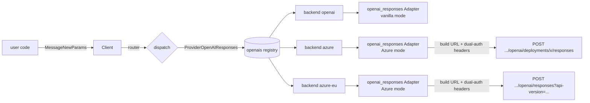
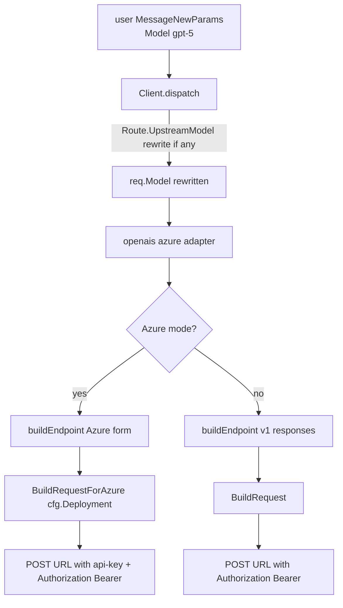

# anthropify v0.2.0 — Azure OpenAI Responses API integration

Status: Approved for v0.2.0 Track E. Companion to
`docs/design/v0.2.0-protocol-driven-adapters.md` (Tracks A/B/D) and
`docs/design/v0.2.0-cache-control.md` (Track C).
Baseline: v0.2.0 main at `382dbf0`.
Author: anthropify maintainers.

## 1. Goals & Non-goals

### Goals
- Add **Azure OpenAI** as a first-class supported provider in v0.2.0,
  Responses API only.
- Public surface: a separate `AzureOpenAIConfig` + `WithAzureOpenAI(name, cfg)`
  helper. Keeps the existing `OpenAIResponsesConfig` clean for the 99 %
  non-Azure users; Azure gets its own discoverable, documented entry
  point. Symmetric with `WithAnthropicCompat` vs `WithAnthropic`.
- Internally reuse the existing `adapter/openai_responses` body builder
  (`BuildRequest`) and SSE→Anthropic converter verbatim — Azure's
  Responses API body shape and SSE event names match OpenAI's. Only
  URL composition and authentication headers differ.
- Support **both** Azure URL forms — auto-pick by whether
  `cfg.Deployment` is set:
  - `Deployment != ""` → `{baseURL}/openai/deployments/{deployment}/responses?api-version={ver}`
  - `Deployment == ""` → `{baseURL}/openai/responses?api-version={ver}`
- Send **both** auth headers on every Azure request:
  `api-key: <key>` (Azure-canonical for resource keys) and
  `Authorization: Bearer <key>` (works with Entra/AAD access tokens
  and matches the llm-proxy reference implementation, which uses the
  OpenAI Go SDK's default Bearer header). Belt-and-suspenders, no
  cost, robust against APIM gateways that strip one or the other.
- Layered fallback for the wire-side `model` field:
  `cfg.Deployment` > `Route.UpstreamModel` > `req.Model`. The first
  non-empty value wins.
- Top-level `cache_control` continues to be a documented silent no-op
  on Azure Responses (Azure caches automatically server-side, same
  contract as vanilla OpenAI).
- Zero breaking changes for v0.1.x / v0.2.0 callers.

### Non-goals (deferred)
- e2e tests against a live Azure resource. Azure resource keys are
  hard to revoke, so v0.2.0 ships **implementation + unit tests +
  docs only**. The pre-existing 32-PASS e2e matrix is preserved
  unchanged.
- Sweden-Central / EastUS / UKSouth region hardcoding +
  `sessionID`-hash routing across regions (llm-proxy-specific
  fanout; not anthropify's business — callers can register one
  `WithAzureOpenAI` per region under distinct names and route by
  prefix or `WithModelOverride`).
- Multi-deployment fan-out under one registration name.
- A separate `ProviderAzureOpenAI` enum kind. Azure rides on the
  existing `ProviderOpenAIResponses` provider with its own `Backend`
  slot — symmetric with how MiniMax rides on `ProviderAnthropic`.
- An auto-default for `APIVersion`. Callers must pass it explicitly so
  upgrades are visible in source control.

## 2. Per-provider research summary

| Concern | Decision | Source / Evidence |
|---|---|---|
| URL form (deployment-bound vs deployment-less) | Support both, auto-switch on `cfg.Deployment` | llm-proxy uses deployment-less at `service/llm/llm_service.go:1999`; Azure docs document deployment-bound at `/openai/deployments/{deployment}/...` |
| Auth header | Send both `api-key` and `Authorization: Bearer` | Azure docs: `api-key` canonical for keys, `Authorization: Bearer` for Entra; llm-proxy uses Bearer via OpenAI SDK at `service/llm/llm_service.go:5377` and works in production |
| Tested api-version | `"2025-03-01-preview"` (`AzureGPT5APIVersion` constant in `library/constants/llm.go:33`) | llm-proxy production traffic |
| Body model field | Fallback chain: `cfg.Deployment` > `Route.UpstreamModel` > `req.Model` | User decision |
| Body shape | Identical to OpenAI Responses (`instructions`, `input`, `tools`, `reasoning`, `max_output_tokens`, …) | Reuse `adapter/openai_responses/request.go::BuildRequest` verbatim |
| SSE event vocabulary | Identical to OpenAI Responses (`response.output_text.delta`, `response.output_item.added`, …) | Reuse `adapter/openai_responses/converter.go` verbatim |
| `cache_control` | Documented no-op (Azure caches server-side automatically) | Same contract as `openai_responses`; Track C matrix extended |

## 3. High-level architecture



The Azure backend rides on the existing `ProviderOpenAIResponses`
registry — no new provider-kind, no new dispatch branch in `client.go`.
`Client.New` learns to construct the same `openai_responses.Adapter`
with Azure-specific `Config` fields populated.

## 4. Public API additions

### 4.1 `options.go`

```go
// AzureOpenAIConfig configures the Azure OpenAI Responses adapter.
// Azure shares the OpenAI Responses wire body and SSE vocabulary; only
// URL composition and auth headers differ. APIVersion is required;
// Deployment selects between the deployment-bound URL form
// (.../openai/deployments/<dep>/responses?api-version=...) and the
// deployment-less form (.../openai/responses?api-version=...) where
// the deployment is carried in the request body's model field.
type AzureOpenAIConfig struct {
    BaseURL      string      // e.g. https://my-resource.openai.azure.com (required)
    APIKey       string      // resource key OR Entra access token (required)
    APIVersion   string      // e.g. 2025-03-01-preview (required)
    Deployment   string      // optional; pins the URL to one deployment
    ExtraHeaders http.Header // merged into every request
}

func WithAzureOpenAI(name string, cfg AzureOpenAIConfig) Option
```

### 4.2 No new provider-kind

`ProviderOpenAIResponses` covers both vanilla OpenAI and Azure; the
`Backend` slot disambiguates. Matches Track A's "one protocol, many
backends" philosophy.

### 4.3 Backend-name namespace

Backend names live in a single namespace per provider-kind. Both
`WithOpenAIResponsesCompat(name, …)` and `WithAzureOpenAI(name, …)`
populate `cli.openais[name]`. `Client.New` rejects duplicate names
across the two helpers with an explicit error.

## 5. Adapter changes — `adapter/openai_responses/`

### 5.1 Extended `Config`

```go
type Config struct {
    // existing
    APIKey       string
    BaseURL      string
    Organization string
    Project      string
    ExtraHeaders http.Header
    HTTPClient   *http.Client

    // NEW (Azure-only; zero values preserve vanilla OpenAI behaviour)
    Azure      bool
    APIVersion string // required when Azure==true
    Deployment string // optional; selects URL form
}
```

`New()` validates: when `Azure==true`, `APIVersion` must be non-empty.

### 5.2 `buildEndpoint`

```go
// buildEndpoint returns the full request URL.
// - vanilla OpenAI: <baseURL>/v1/responses
// - Azure deployment-less: <baseURL>/openai/responses?api-version=<ver>
// - Azure deployment-bound: <baseURL>/openai/deployments/<dep>/responses?api-version=<ver>
func (a *Adapter) buildEndpoint() string
```

Trailing slashes on `BaseURL` are trimmed exactly once.

### 5.3 Dual-auth header path

```go
if a.cfg.Azure {
    httpReq.Header.Set("api-key", a.cfg.APIKey)
    httpReq.Header.Set("Authorization", "Bearer "+a.cfg.APIKey)
} else {
    httpReq.Header.Set("Authorization", "Bearer "+a.cfg.APIKey)
    if a.cfg.Organization != "" { httpReq.Header.Set("OpenAI-Organization", a.cfg.Organization) }
    if a.cfg.Project != ""      { httpReq.Header.Set("OpenAI-Project", a.cfg.Project) }
}
```

`ExtraHeaders` merged in both modes.

### 5.4 Wire-side `model` override

A new exported wrapper around `BuildRequest`:

```go
// BuildRequestForAzure mirrors BuildRequest but overrides the wire
// body's `model` field with effectiveModel when non-empty. Used by the
// adapter when cfg.Deployment is set.
func BuildRequestForAzure(ctx context.Context, req anthropicsdk.MessageNewParams,
    stream bool, effectiveModel string) ([]byte, error)
```

The Q4 layered fallback `cfg.Deployment > Route.UpstreamModel > req.Model`
is realised end-to-end:

- `Route.UpstreamModel` is already applied by `Client.dispatch` before
  the adapter sees `req` (existing behaviour, `client.go:165-166`).
- The adapter computes `effectiveModel = cfg.Deployment` (or empty if
  unset). Empty → `BuildRequestForAzure` keeps `req.Model` verbatim.

### 5.5 No changes to body semantics, converter, or IDs

Reuse `BuildRequest` body shape and `converter.go` SSE→Anthropic logic
verbatim. Cache-control no-op proof tests (Track C) automatically
cover Azure since they exercise `BuildRequest` itself; we add an
explicit Azure-flavoured assertion for belt-and-suspenders.

## 6. Client wiring — `client.go`

```go
for name, ac := range cfg.azureOpenAI {
    if _, dup := cli.openais[name]; dup {
        return nil, fmt.Errorf(
            "anthropify: backend name %q registered as both OpenAI and Azure", name)
    }
    a, err := openairesponses.New(name, openairesponses.Config{
        APIKey:       ac.APIKey,
        BaseURL:      ac.BaseURL,
        ExtraHeaders: ac.ExtraHeaders,
        HTTPClient:   cfg.httpClient,
        Azure:        true,
        APIVersion:   ac.APIVersion,
        Deployment:   ac.Deployment,
    })
    if err != nil {
        return nil, fmt.Errorf("anthropify: azure_openai[%s] adapter: %w", name, err)
    }
    cli.openais[name] = a
}
```

`Client.dispatch` is **unchanged** — it already routes
`ProviderOpenAIResponses` through `cli.openais[backend]`.

## 7. Translation path



## 8. Verification

### 8.1 Unit tests

In `adapter/openai_responses/adapter_test.go` (new):
- `TestBuildEndpoint_VanillaOpenAI`
- `TestBuildEndpoint_AzureDeploymentless`
- `TestBuildEndpoint_AzureDeploymentBound`
- `TestBuildEndpoint_AzureTrailingSlashTrim`
- `TestNew_AzureRequiresAPIVersion`
- `TestNew_VanillaUnaffected`

In `adapter/openai_responses/adapter_headers_test.go` (new, uses
`httptest.Server`):
- `TestStream_AzureSendsBothAuthHeaders` — assert both
  `api-key: <key>` and `Authorization: Bearer <key>` present, and
  `OpenAI-Organization`/`OpenAI-Project` absent.
- `TestStream_VanillaSendsOnlyBearer` — assert `api-key` absent.
- `TestStream_AzureExtraHeadersMerged`
- `TestStream_AzureURLDeploymentBound` — record `r.URL.Path` and query.

In `adapter/openai_responses/request_test.go` (extended):
- `TestBuildRequestForAzure_OverridesModel`
- `TestBuildRequestForAzure_EmptyOverrideKeepsCanonical`
- `TestBuildRequestForAzure_CacheControlNoop`

In `client_multibackend_test.go` (extended):
- `TestNew_AzureBackendRegistered`
- `TestNew_AzureBackendDuplicateNameRejected`
- `TestDispatch_AzureRouteByPrefix`

### 8.2 Existing tests unaffected

All vanilla-OpenAI cases must remain byte-identical. The refactor
moves URL composition into `buildEndpoint`; the vanilla branch
produces the same string as before.

### 8.3 No e2e tests added

Per user decision: Azure resource keys are hard to revoke, so v0.2.0
Track E ships impl + unit tests + docs only. The pre-existing
`./scripts/test-e2e.sh -v` 32-PASS / 0-FAIL run remains green and
unchanged.

### 8.4 Definition of Done

- `go build ./...` clean.
- `go vet ./...` clean.
- `go test ./...` all green (existing + new unit tests).
- `./scripts/test-e2e.sh -v` (against the original `.env.e2e`) still
  reports 32 PASS / 0 FAIL.
- HEAD on top of `382dbf0`, three logical local commits, **unpushed**:
  1. `docs(v0.2.0 Track E): design doc for Azure OpenAI Responses`
  2. `feat(v0.2.0 Track E): Azure OpenAI Responses adapter`
  3. `docs(v0.2.0 Track E): README sections for Azure OpenAI`

## 9. Risks & mitigations

| Risk | Likelihood | Mitigation |
|---|---|---|
| Azure APIM front-door strips `Authorization` | medium | also send `api-key` |
| Azure APIM front-door strips `api-key` | low | also send `Authorization: Bearer` |
| Old `api-version` rejects body fields (e.g. `parallel_tool_calls`) | low | document tested api-version range; body builder reused |
| Future Azure SSE event drift | low | reuse converter; covered by existing OpenAI tests |
| Caller registers same name under both helpers | medium | duplicate-name guard in `Client.New` returns error |
| Caller forgets `APIVersion` | high | `Adapter.New` returns explicit error; documented in godoc |
