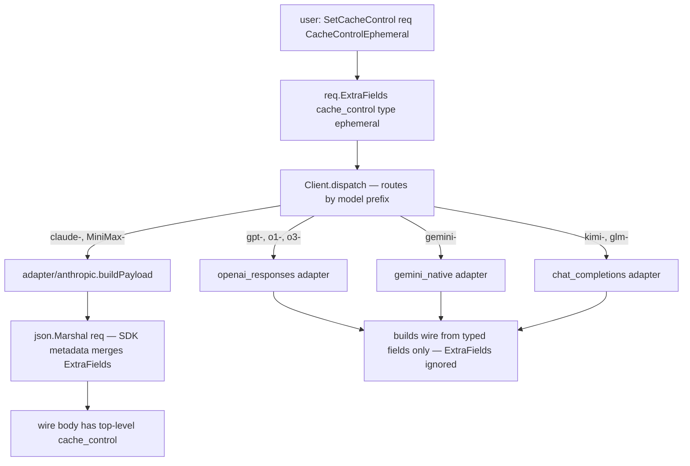

# anthropify v0.2.0 — Top-level `cache_control` on the canonical layer

Status: Approved for v0.2.0 Track C. Companion to
`docs/design/v0.2.0-protocol-driven-adapters.md` (Tracks A/B/D).
Baseline: v0.2.0 main at `8a20ec8`.
Author: anthropify maintainers.

## 1. Goals & Non-goals

### Goals
- Add a typed canonical Go API for Anthropic's **top-level
  `cache_control`** automatic-caching mode (announced alongside the
  existing per-block 4-tag mode at
  <https://platform.claude.com/docs/en/build-with-claude/prompt-caching>).
- Translate the canonical field to wire JSON only on backends where it
  has a defined upstream meaning (`adapter/anthropic` — covers both
  Anthropic Inc. and MiniMax via `WithAnthropicCompat`).
- Document — and prove via tests — that the field is a **silent no-op**
  on every other backend (`openai_responses`, `gemini_native`,
  `chat_completions`), because those vendors cache automatically
  server-side and have no analogous request field.
- Keep the per-block manual 4-tag mode (caller does
  `block.SetExtraFields(map[string]any{"cache_control": …})` on
  individual content blocks) **unchanged** and fully working.
- Zero breaking changes for v0.1.x / v0.2.0 callers.

### Non-goals (deferred)
- `ttl="1h"` and the `anthropic-beta: extended-cache-ttl-2025-04-11`
  header (extended caching at 2× base input price). Defer until the
  feature graduates fully out of beta or there is concrete user demand.
- A `Client`-level `WithCacheControl(...)` `Option` default. Caching
  policy is request-shape-dependent; a global default is rarely
  correct. Easy to add later non-breakingly.
- A unified canonical abstraction over Gemini's explicit `cachedContent`
  resource API (it is a separate resource lifecycle, not a per-request
  flag).
- Forwarding Kimi's `prompt_cache_key` sticky-routing field; that is
  per-vendor sugar, not the same concept.

## 2. Per-provider research summary

| Provider | Caching mode | Top-level field on `/messages`-shaped request? | Decision |
|---|---|---|---|
| Anthropic native | Automatic *and* explicit per-block | **Yes** — `cache_control: {type: "ephemeral"}` | **Translate** |
| MiniMax (`/anthropic/v1/messages`) | Automatic + explicit per-block | Per-block documented; top-level not contradicted | **Translate** (forward unchanged) |
| OpenAI Responses | Automatic, prompts > 1024 tokens | None | **No-op** |
| Gemini Native (2.5+) | Implicit cache automatic + explicit `cachedContent` resource | None on `streamGenerateContent` | **No-op** |
| Kimi (Moonshot, chat_completions) | Automatic prefix cache | None (only optional `prompt_cache_key` for sticky routing) | **No-op** |
| GLM (Z.ai, chat_completions) | Fully implicit / automatic | None | **No-op** |

References:
- <https://platform.claude.com/docs/en/build-with-claude/prompt-caching>
- <https://openai.com/index/api-prompt-caching/>
- <https://developers.googleblog.com/gemini-2-5-models-now-support-implicit-caching/>
- <https://docs.z.ai/guides/capabilities/cache>
- <https://platform.minimax.io/docs/api-reference/anthropic-api-compatible-cache>
- <https://forum.moonshot.ai/t/cached-tokens-drop-when-tool-has-interleaved-thinking/216>

The top-level form does **not** require the
`anthropic-beta: prompt-caching-2024-07-31` header anymore — that
header was retired once prompt caching shipped GA. The `ttl="1h"`
extended form *does* still need a beta header; we are deferring that
form (see Non-goals).

## 3. API design

### 3.1 The canonical types

Added in a new top-level file `cache_control.go`:

```go
// CacheControlType discriminates a cache_control entry. Currently the
// only legal value is CacheControlEphemeral.
type CacheControlType string

const CacheControlEphemeral CacheControlType = "ephemeral"

// CacheControl is the canonical top-level prompt-caching toggle.
// Translates to Anthropic's wire field {"cache_control":{"type":...}}
// on adapter/anthropic; documented no-op on all other adapters.
type CacheControl struct {
    Type CacheControlType `json:"type"`
}
```

### 3.2 Per-request opt-in helper

Also in `cache_control.go`:

```go
// SetCacheControl installs (or clears, when cc.Type == "") a top-level
// cache_control directive on req. It writes via the SDK's
// param.metadata.SetExtraFields, so the canonical struct stays
// dependency-free and the manual per-block 4-tag mode is unaffected.
func SetCacheControl(req *MessageNewParams, cc CacheControl)

// GetCacheControl returns the currently-installed directive, if any.
func GetCacheControl(req MessageNewParams) (CacheControl, bool)
```

### 3.3 Why per-call, not `Option`

Decided in clarification Q0 (option B). Rationale:
- Caching policy is request-shape-sensitive (system size, doc
  attachments). A global default is rarely the right thing.
- `config` stays lean.
- Source-compat to add a `WithCacheControl(default)` `Option` later if
  ever needed.

## 4. Translation path



### 4.1 anthropic adapter

`adapter/anthropic/anthropic.go::buildPayload` already round-trips the
canonical `MessageNewParams` through `json.Marshal` →
`map[string]any` → `json.Marshal`. The SDK's `metadata.MarshalJSON`
merges any `ExtraFields` into the top-level object, so the path
**already works** without code change. We add a defensive contract
test to ensure that property is not lost in future SDK upgrades.

MiniMax routes through the same adapter (Track A in
`v0.2.0-protocol-driven-adapters.md`), so it gets the same translation
for free.

### 4.2 Other adapters

`openai_responses`, `gemini_native`, and `chat_completions` build
their wire payload from typed fields on `MessageNewParams` only
(`Model`, `Messages`, `Tools`, `System`, …). They never serialise
`req` through a passthrough map, so `ExtraFields["cache_control"]`
is naturally dropped.

We add a one-paragraph doc comment to each `request.go` /
`converter.go` entry point explaining "top-level `cache_control` is
intentionally not propagated; the upstream caches automatically." We
also add negative builder tests proving the produced wire payload
does not contain the field.

## 5. ExtraFields manipulation detail

The Anthropic SDK exposes `SetExtraFields(map[string]any)` and
`ExtraFields() map[string]any` on every `param.APIObject`-embedded
struct, including `MessageNewParams`. The implementation:

```go
func SetCacheControl(req *MessageNewParams, cc CacheControl) {
    extras := req.ExtraFields()
    out := make(map[string]any, len(extras)+1)
    for k, v := range extras { out[k] = v }
    if cc.Type == "" {
        delete(out, "cache_control")
    } else {
        out["cache_control"] = map[string]any{"type": string(cc.Type)}
    }
    req.SetExtraFields(out)
}
```

Properties:
- Idempotent.
- Empty `Type` clears.
- Preserves any unrelated `ExtraFields` (e.g. future `metadata`).
- Pure function on `*MessageNewParams`, no global state.

## 6. Verification

### 6.1 Unit tests
- `cache_control_test.go::TestSetCacheControl_RoundTrip` — set, then
  `json.Marshal(req)`, assert top-level `cache_control` present.
- `cache_control_test.go::TestSetCacheControl_Clear` — clear with
  empty `Type`, assert key removed.
- `cache_control_test.go::TestSetCacheControl_PreservesOtherExtras`
  — coexist with another extra field.
- `adapter/anthropic/anthropic_test.go::TestBuildPayload_TopLevelCacheControl`
  — exercises the real `buildPayload`.

### 6.2 No-op proof tests
- `adapter/openai_responses/request_test.go` — wire payload from a
  request with `SetCacheControl` set must **not** contain
  `cache_control`.
- `adapter/chat_completions/request_test.go` — same.
- (Gemini covered by code inspection — its converter never reads
  `ExtraFields`.)

### 6.3 e2e against live Anthropic
- `e2e/anthropic_test.go::TestE2E_Anthropic_CacheControl_TopLevel`
  - Round 1 with a long enough system prompt + `SetCacheControl(...)`,
    assert `usage.cache_creation_input_tokens > 0`.
  - Round 2 identical request, assert `usage.cache_read_input_tokens > 0`.

### 6.4 Definition of Done
- `go build ./...` clean.
- `go test ./...` all green.
- `./scripts/test-e2e.sh -v` — pre-existing 31+ PASS / 0 FAIL preserved,
  plus the new top-level-cache_control e2e test.
- HEAD on top of `8a20ec8`, four logical local commits (design,
  impl, README docs, e2e), unpushed.

## 7. Risks

- **SDK metadata merge invariant.** If the SDK's
  `metadata.MarshalJSON` ever stops merging `ExtraFields` into the
  top-level object, the path silently regresses. Mitigation: §6.1's
  contract test guards this on every CI run.
- **MiniMax may reject unknown top-level fields.** Their public docs
  describe the per-block form only; the top-level form may be silently
  ignored or hard-rejected. We accept silent ignore. If a hard-reject
  is observed in the wild, follow-up adds a per-`AnthropicConfig`
  `SuppressTopLevelCacheControl bool` knob without changing the
  canonical API.
