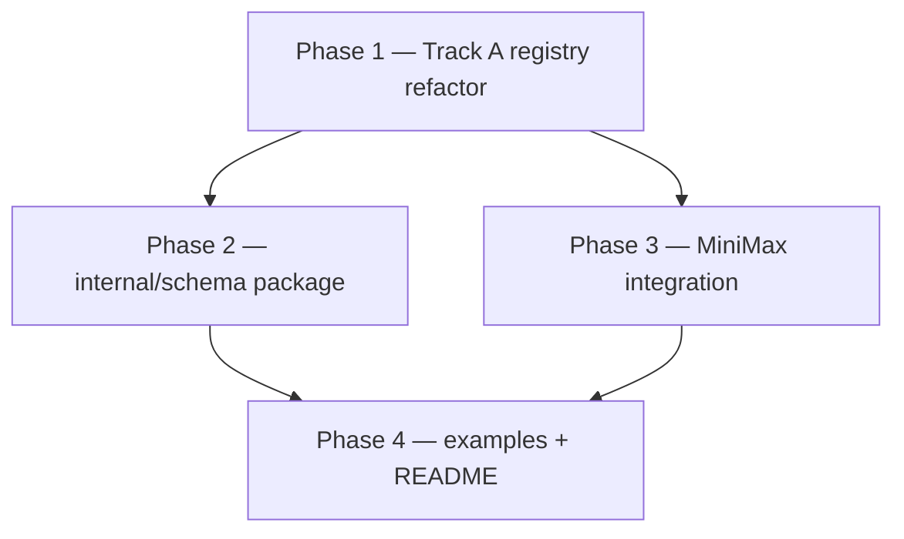

# anthropify v0.2.0 — Protocol-driven, vendor-agnostic adapters

Status: Draft for v0.2.0 (planning only; no code in this doc).
Baseline: v0.1.0-alpha at `72a0b64` (unpushed).
Author: anthropify maintainers.

## 1. Goals & Non-goals

### Goals
- Make the two single-instance protocol adapters (`anthropic`,
  `openai_responses`) into multi-backend registries — one adapter type, many
  named backends — matching the existing `chat_completions` pattern at
  `adapter/chat_completions/adapter.go:60-74`.
- Enable third-party Anthropic-compatible providers (e.g. MiniMax at
  `https://api.minimax.io/anthropic/v1/messages`, model `MiniMax-M2.7`) to
  coexist with Anthropic Inc. in **one** `anthropify.Client`.
- Centralize tool-schema dialect handling. Today the four adapters
  disagree: `anthropic` passes through, `openai_responses` passes through
  (latent OpenAI-Strict bug at `adapter/openai_responses/request.go:188-215`),
  `chat_completions` runs `cleanSchemaForAzure`
  (`adapter/chat_completions/request.go:430-510`), `gemini_native` runs a
  22-key whitelist that **silently drops** features such as `oneOf`,
  `multipleOf`, `not`, `$ref`
  (`adapter/gemini_native/request.go:357-470`).
- First-class MiniMax support, end-to-end verified (already manually
  confirmed: HTTP 200 + standard Anthropic response with thinking block).
- Zero breaking changes for v0.1.x callers.

### Non-goals (deferred to v0.3.0+)
- Per-request `RequestOption` / per-request beta header injection.
- DeepSeek dedicated example.
- llm-proxy dogfooding harness.
- Future provider kinds such as `ProviderBedrockAnthropic`.
- Promoting `GeminiModeVertex` / `GeminiModeExpress` to README primary flow.

## 2. High-level architecture

```mermaid
flowchart LR
    User[User code] -->|MessageNewParams| Client
    Client -->|router.resolve| Route[Route&#123;Provider, Backend, UpstreamModel&#125;]
    Route --> Dispatch{dispatch}
    Dispatch -->|ProviderAnthropic| AReg[(anthropics&#58;<br/>map name -> Adapter)]
    Dispatch -->|ProviderOpenAIResponses| OReg[(openais&#58;<br/>map name -> Adapter)]
    Dispatch -->|ProviderGeminiNative| Gem[gemini Adapter<br/>single]
    Dispatch -->|ProviderChatCompletions| CReg[(chats&#58;<br/>map name -> Adapter)]
    AReg --> A1[anthropic-inc]
    AReg --> A2[minimax]
    OReg --> O1[openai]
    OReg --> O2[third-party-compat]
    CReg --> C1[kimi]
    CReg --> C2[glm]
    CReg --> C3[deepseek]
    A1 & A2 & O1 & O2 & Gem & C1 & C2 & C3 -->|tool schema| Norm[internal/schema<br/>shared normalizer + per-adapter dialect]
```



The diagram makes the v0.1 → v0.2 transition explicit: the boxes that were
previously single pointers (`anthropic`, `openai`) become registries, while
`gemini` stays single (Track D).

## 3. Track A — Multi-backend protocol adapters

### 3.1 Public API additions

```go
// New helpers (multi-backend).
func WithAnthropicCompat(name string, cfg AnthropicConfig) Option
func WithOpenAIResponsesCompat(name string, cfg OpenAIResponsesConfig) Option
```

`OpenAIResponsesConfig` is the renamed/cloned shape of today's
`OpenAIConfig` (`options.go:26-39`). The legacy name `OpenAIConfig` stays
as a type alias for source compat.

### 3.2 Backward-compat (Q1 — answered)

**Decision: strategy (a) sugar-for-default-named-backend.** Both planner
runs agreed.

- `WithAnthropic(cfg)` is exactly `WithAnthropicCompat("anthropic", cfg)`.
- `WithOpenAI(cfg)` is exactly `WithOpenAIResponsesCompat("openai", cfg)`.
- Default model-prefix routes (`options.go:179-192`) keep
  `Route{Provider: ProviderAnthropic, Backend: ""}`. The dispatcher treats
  empty `Backend` as `"anthropic"` for `ProviderAnthropic` and `"openai"`
  for `ProviderOpenAIResponses`.

Rationale:
- Idiomatic Go: minimal API surface, no dual routing concepts to teach.
- Zero source change for v0.1.x users (verified by sample programs in §8).
- Symmetric with `chat_completions` which v0.1 users already understand.
- The names `"anthropic"` and `"openai"` become reserved; documented.

### 3.3 Provider enum (Q-A2 — answered)

**Decision: repurpose the existing constants, no new kinds.**

`ProviderAnthropic` and `ProviderOpenAIResponses` become multi-backend.
`Route.Backend` is now meaningful for all four providers; the comment at
`options.go:104-106` ("ignored for other providers") is corrected.

### 3.4 Internal registry (Q-A3 — answered)

```go
type config struct {
    httpClient *http.Client
    logger     *slog.Logger

    // Multi-backend protocol adapters (NEW shape).
    anthropicCompat       map[string]AnthropicConfig
    openaiResponsesCompat map[string]OpenAIResponsesConfig
    chatCompat            map[string]OpenAICompatConfig

    // Single-instance (Track D — stays single in v0.2.0).
    gemini *GeminiConfig

    modelRoutes map[string]Route
    overrideFn  func(model string) (Route, bool)

    schemaPolicy SchemaPolicy // §4
}

type Client struct {
    cfg        *config
    anthropics map[string]adapter.Adapter
    openais    map[string]adapter.Adapter
    gemini     adapter.Adapter
    chats      map[string]adapter.Adapter
}
```

Each adapter instance owns its own `cfg` (APIKey, BaseURL, Version,
ExtraHeaders). `HTTPClient` may be shared; this is documented (§9 risks).
Adapter constructors gain a `name string` argument — symmetric to
`adapter/chat_completions/adapter.go:66`. `Adapter.Name()` returns
`"anthropic:<name>"` / `"openai_responses:<name>"`.

### 3.5 Dispatcher update

`client.go:140-172` evolves so that the `ProviderAnthropic` and
`ProviderOpenAIResponses` arms also read `route.Backend`, defaulting to
`"anthropic"` / `"openai"` when empty, and return
`ErrProviderNotConfigured: anthropic[<name>]` for unknown names.

### 3.6 Default routes (Q-A4 — answered)

Built-in routes at `options.go:184-190` keep their current shape (empty
Backend). Users adding a third-party Anthropic-compat backend must add a
prefix rule, e.g.:

```go
ap.WithModelRoute("MiniMax-",
    ap.Route{Provider: ap.ProviderAnthropic, Backend: "minimax"})
```

Model-name collisions with real Claude are impossible because MiniMax
model strings start with `MiniMax-`.

### 3.7 Unit-test plan (Q-A5 — answered)

In `client_test.go` / new `client_multibackend_test.go` (still part of
the `anthropify` package), using `httptest.Server` stubs:

1. **Routing isolation.** Two anthropic backends with distinct BaseURL +
   APIKey. Send a request that resolves to backend "minimax", assert the
   stub for "minimax" received the call and the "anthropic" stub did not,
   and the `x-api-key` header on the inbound request matches MiniMax's
   key.
2. **Header isolation.** Different `ExtraHeaders` per backend (e.g.
   `X-Tenant: a` vs `X-Tenant: b`). Confirm no cross-bleed.
3. **Error isolation.** Stub "minimax" returns 500; ensure subsequent
   call routed to "anthropic" still succeeds.
4. **Backward-compat.** Single `WithAnthropic(cfg)` registers the
   "anthropic" key; default `claude-…` routing still works without any
   user-provided `WithModelRoute`.
5. **Unknown backend.** `Route.Backend = "missing"` returns
   `ErrProviderNotConfigured` wrapping the backend name.
6. **OpenAI parity.** Same five tests for `WithOpenAIResponsesCompat`.

## 4. Track B — Tool schema dialect normalization

### 4.1 Capability matrix (Q-B1)

| Schema feature | `anthropic` | `openai_responses` (Strict) | `openai_responses` (non-Strict) | `gemini_native` | `chat_completions` (Azure-flavoured Strict) | `chat_completions` (permissive) |
|---|---|---|---|---|---|---|
| `type` (object/array/string/number/boolean/integer) | OK | OK | OK | OK (lowercased) | OK (lowercased) | OK |
| `type: null` / `["string","null"]` | OK | OK | OK | rewrite to `nullable: true` | OK | OK |
| `properties`, `required` | OK | OK | OK | OK | OK | OK |
| `enum` | OK | OK | OK | OK | OK | OK |
| `oneOf` | OK | OK | OK | rewrite to `anyOf` (warn) | OK | OK |
| `anyOf` | OK | OK | OK | OK | OK | OK |
| `allOf` | OK | drop or error | OK | drop (warn) | drop (warn) | OK |
| `not` | OK | drop or error | OK | drop (warn) | drop (warn) | OK |
| `format` (date-time, email, uri, …) | OK | OK | OK | OK (passthrough; Gemini honours subset) | OK | OK |
| `pattern` | OK | OK | OK | OK | OK | OK |
| `minimum` / `maximum` | OK | OK | OK | OK | OK | OK |
| `exclusiveMinimum` / `exclusiveMaximum` | OK | OK | OK | drop (warn) | OK | OK |
| `minLength` / `maxLength` | OK | OK | OK | OK | OK | OK |
| `minItems` / `maxItems` | OK | OK | OK | OK | OK | OK |
| `uniqueItems` | OK | OK | OK | drop (warn) | OK | OK |
| `multipleOf` | OK | OK | OK | drop (warn) | OK | OK |
| `additionalProperties: true` | OK | **error / downgrade** | OK | drop | downgrade to `false` (warn) | OK |
| `additionalProperties: false` | OK | OK | OK | drop | OK (default) | OK |
| `additionalProperties: schema` | OK | error | OK | drop (warn) | drop (warn) | OK |
| `$ref` / `$defs` / recursion | OK | error | error | error | error | error |
| `$schema` | OK | drop | drop | drop | drop | drop |
| `default` | OK | OK | OK | OK | OK | OK |
| `description` / `title` | OK | OK | OK | OK | OK | OK |
| `nullable` (Gemini) | OK (treated as extra) | drop | drop | OK | drop | drop |
| `propertyOrdering` (Gemini) | drop | drop | drop | OK | drop | drop |

Cells use `OK / drop / error / rewrite / downgrade`. The matrix is
authoritative for the v0.2.0 normalizer; deviations require a doc PR.

### 4.2 Conversion-layer architecture (Q2 — answered)

**Decision: shared core + adapter-specific dialect overrides** (option
ii). New package: `internal/schema`.

```go
// internal/schema/schema.go

// Dialect declares one upstream's capabilities. Adapters register a
// constant Dialect; the normalizer drives conversion off it.
type Dialect struct {
    Name                       string  // "anthropic", "openai_strict", "gemini", "azure_strict", ...
    SupportsOneOf              bool
    SupportsAllOf              bool
    SupportsNot                bool
    SupportsRefs               bool
    SupportsAdditionalProps    AdditionalPropsMode  // Allow, ForceFalse, Drop, Error
    SupportsExclusiveBounds    bool
    SupportsMultipleOf         bool
    SupportsUniqueItems        bool
    UseGeminiNullable          bool
    LowercaseType              bool
    SortProperties             bool
    StripSchemaKey             bool
    MaxRecursionDepth          int
    AllowedKeys                map[string]bool // optional whitelist (Gemini)
}

// Normalize lowers a canonical Anthropic-shape schema to dialect.
// Warnings list non-fatal lossy transforms; err is non-nil only when
// policy promotes a warning to a hard error.
func Normalize(canonical map[string]any, dialect Dialect, policy Policy) (out map[string]any, warnings []Warning, err error)

type Warning struct {
    Path   string // dot-path inside the schema, e.g. "properties.user.oneOf"
    Code   string // "drop_oneof", "downgrade_additional_props", ...
    Detail string
}
```

Each adapter declares its own constant `Dialect` and calls
`schema.Normalize`. The legacy `cleanSchemaForAzure` and
`sanitizeSchemaForGemini` functions become thin wrappers (and can be
deleted once tests pass).

### 4.3 Error-feedback policy (Q3 — answered)

**Decision: tiered, configurable via a top-level `SchemaPolicy`.**

Disagreement note (planner Plan 2): construct-time validation is
impossible because tools are per-request, not registered at `New()`.
**Resolved**: `SchemaPolicy` is consulted at request time, immediately
before adapter `Stream`/`Invoke` build the payload. The `New()`-time
policy slot is simply where the user *configures* the tier.

```go
type SchemaPolicy int

const (
    SchemaPolicyStrict     SchemaPolicy = iota // default — error on any non-cosmetic transform
    SchemaPolicyLossy                          // warn-and-transform for lossy-but-viable conversions
    SchemaPolicyBestEffort                     // warn-and-drop for everything that isn't fatal
)

func WithSchemaPolicy(p SchemaPolicy) Option
```

Behavioural rules:
- **Cosmetic transforms always succeed silently:** lowercase `type`, drop
  `$schema`, sort property keys, dedupe `required`.
- **Lossy transforms** (e.g. `oneOf` → `anyOf` for Gemini, `multipleOf`
  drop, `uniqueItems` drop): under `Strict` → return Go error; under
  `Lossy` → log via `slog.Warn` and proceed; under `BestEffort` → log and
  proceed.
- **Fatal-incompatibility transforms** (e.g. `$ref`, recursion deeper
  than `MaxRecursionDepth`, `additionalProperties: schema` on dialects
  that do not support it): always return Go error, regardless of policy
  (modulo the override in `BestEffort` only for the
  `additionalProperties: true` → `false` downgrade on OpenAI Strict).
- **Default tier is `Strict`** so v0.1.x users that happened to feed
  Gemini-incompatible schemas now get a clear error rather than silent
  corruption (the toy `examples/04-tool-use-portable` schema is
  unaffected because it uses only `type/properties/required`).

Errors are wrapped: `fmt.Errorf("%w: %s", ErrSchemaIncompatible,
warning.Detail)` so callers can `errors.Is(err, ErrSchemaIncompatible)`.

### 4.4 Test matrix (Q-B4)

Fixtures under `internal/schema/testdata/` (golden JSON pairs:
`<case>.canonical.json` → `<case>.<dialect>.json`):

| # | Fixture | Anthropic | OpenAI Strict | Gemini | Azure Strict |
|---|---|---|---|---|---|
| 1 | Nested object + `required` + `enum` | identity | identity | sorted props | sorted props |
| 2 | Array of object with `description` | identity | identity | identity | identity |
| 3 | `oneOf` of two object shapes | identity | identity | rewritten to `anyOf` (warn) | identity |
| 4 | `$ref` reference | identity | error | error | error |
| 5 | `additionalProperties: true` | identity | error (Strict) / downgrade (BestEffort) | dropped | downgraded to `false` |
| 6 | `format: date-time` | identity | identity | identity | identity |
| 7 | `pattern` regex | identity | identity | identity | identity |
| 8 | Recursive tree (`children: { $ref: "#" }`) | identity | error | error | error |
| 9 | `multipleOf: 0.5` | identity | identity | dropped (warn) | identity |
| 10 | `type: ["string","null"]` | identity | identity | rewritten to `nullable: true` | identity |

Each fixture is exercised:
- Pure unit tests in `internal/schema/normalize_test.go` against the
  golden output.
- Live e2e in `e2e/schema_dialect_test.go` (skipped when keys missing)
  that fires a tool-use request through each provider with the canonical
  schema and asserts a non-error response.

### 4.5 Example-04 upgrade

`examples/04-tool-use-portable/main.go:41-55` is replaced with a richer
schema: nested object (`location: { city: string, country: string }`),
`enum` for `unit ∈ {"celsius","fahrenheit"}`, `additionalProperties:
false`, and a top-level `description`. This stresses the normalizer
across all four providers.

### 4.6 README dialect section

A new section "Tool schema portability" lists the capability matrix
(condensed), the three `SchemaPolicy` tiers, and a one-liner "default is
Strict; opt into Lossy for Gemini-friendly behaviour".

## 5. Track C — MiniMax integration

### 5.1 Sequencing

Lands immediately after Track A is merged. Independent of Track B (the
MiniMax endpoint is Anthropic-canonical, so the default `anthropic`
dialect applies).

### 5.2 Registration form

```go
client, _ := ap.New(
    ap.WithAnthropic(ap.AnthropicConfig{APIKey: anthropicKey}), // sugar for "anthropic"
    ap.WithAnthropicCompat("minimax", ap.AnthropicConfig{
        BaseURL: "https://api.minimax.io/anthropic",
        APIKey:  os.Getenv("MINIMAX_API_KEY"),
    }),
    ap.WithModelRoute("MiniMax-",
        ap.Route{Provider: ap.ProviderAnthropic, Backend: "minimax"}),
)
```

`AnthropicConfig.Version` (`options.go:42-46`, default `2023-06-01`)
applies as-is; we do not assume MiniMax requires a different value, but
because each backend gets its own config, individual override is free.

### 5.3 Thinking-block pass-through

Anthropic SSE pass-through at `adapter/anthropic/anthropic.go:110-128`
forwards every event verbatim, so MiniMax's thinking blocks reach the
caller without code changes. Verified manually against `MiniMax-M2.7`.

### 5.4 Example placement (Q4 — answered)

**Decision: do both.** Planners disagreed; we adopt Plan 2's stance with
Plan 1's dimensioning:

- **Upgrade `examples/02-multi-provider`** to include MiniMax as the 5th
  provider. This is the headline "1 client, 5 providers, 1 protocol"
  demo and is the most visible artifact for casual readers.
- **New small example `examples/07-anthropic-compat`** focused
  exclusively on the *protocol != vendor* narrative: same Anthropic
  protocol, two different vendors (Claude + MiniMax) registered side by
  side. Body is intentionally short (~50 lines); README pitches it as
  "the v0.2.0 thesis demo".

### 5.5 e2e test

New `e2e/anthropic_minimax_test.go` mirroring `e2e/anthropic_test.go`,
skipping when `MINIMAX_API_KEY` is unset. Runs streaming + non-streaming
+ tool-use + thinking-block assertions against `MiniMax-M2.7`.

### 5.6 README

"Supported providers" gains MiniMax row: env vars `MINIMAX_API_KEY` /
`MINIMAX_BASE_URL`, default model `MiniMax-M2.7`. A short callout under
"Why protocol-driven" links to example 07.

## 6. Track D — Locked decisions (no further discussion)

### 6.1 Beta header policy

`ExtraHeaders` is **init-time only** in v0.2.0. We do not add a
per-request `RequestOption` mechanism.

Rationale:
- Per-request injection requires touching every adapter's request-build
  path (`adapter/anthropic/anthropic.go:155-170`, `chat_completions/
  request.go`, `gemini_native/request.go`, `openai_responses/
  request.go`) and growing the public surface.
- The common case ("user pins one set of beta features per client") is
  already covered: `AnthropicConfig.ExtraHeaders` (`options.go:42-47`).
- Users that need different betas instantiate two clients.
- Defer until v0.3.0, after the Anthropic beta surface stabilises.

### 6.2 Gemini auth

v0.2.0 documents only **AI Studio** (`GeminiModeStudio`,
`options.go:21-22`). `GeminiModeVertex` and `GeminiModeExpress` adapter
code stays in tree but is not in the README primary flow; they are
listed under "Advanced".

## 7. Validation matrix (locked)

| Provider | Adapter | Model | Streaming | Non-streaming | Tool-use | Thinking |
|---|---|---|:-:|:-:|:-:|:-:|
| Anthropic | `anthropic` | `claude-opus-4-7` | ✓ | ✓ | ✓ | ✓ |
| OpenAI Responses | `openai_responses` | `gpt-5.5` | ✓ | ✓ | ✓ | ✓ |
| Gemini Native (Studio) | `gemini_native` | `gemini-3.5-flash` (default), Pro probe `gemini-3.1-pro-preview` / `gemini-3-pro-preview` / `gemini-pro-latest` | ✓ | ✓ | ✓ | ✓ |
| Kimi | `chat_completions` | `kimi-k2.6` | ✓ | ✓ | ✓ | n/a |
| GLM | `chat_completions` | `glm-5.1` | ✓ | ✓ | ✓ | n/a |
| MiniMax (NEW) | `anthropic` (compat backend) | `MiniMax-M2.7` | ✓ | ✓ | ✓ | ✓ |

`e2e/matrix_test.go` is extended with the MiniMax row. The Pro probes
are run only when their respective feature flags are set, mirroring
existing skip logic in `e2e/gemini_native_test.go`.

## 8. Migration guide (v0.1.x → v0.2.0)

**Target: zero source change for existing users.** Verified by walking
both shipped examples:

- `examples/02-multi-provider/main.go:17-39` (`WithAnthropic`,
  `WithGemini`, two `WithChatCompletion`) compiles unchanged. The
  `WithAnthropic` line is now sugar for `WithAnthropicCompat("anthropic",
  …)`, but the user observes nothing.
- `examples/04-tool-use-portable/main.go:21-33` (adds `WithOpenAI`)
  similarly unchanged. Behaviour is identical because the toy schema
  uses only universal features.

What v0.2.0 newcomers should know:
- To register a third-party Anthropic-compat backend, use
  `WithAnthropicCompat` plus `WithModelRoute`.
- Tool schemas now run through a normalizer; the default policy
  (`SchemaPolicyStrict`) errors on lossy conversions. Users that hit
  this can call `WithSchemaPolicy(SchemaPolicyLossy)` to restore the
  v0.1.x silent-degrade behaviour.

## 9. Risks & open questions

### Risks
- **MiniMax feature gaps.** Anthropic compatibility may not extend to
  prompt caching (`cache_control`), system-prompt arrays, or stop
  sequences. Mitigation: `e2e/anthropic_minimax_test.go` covers
  baseline; document gaps as discovered in the README "Provider notes".
- **Shared `http.Client` pool.** `WithHTTPClient`
  (`options.go:113-115`) is global; multiple compat backends share its
  connection pool. Document that callers needing per-backend isolation
  should pass distinct clients via `cfg.HTTPClient` once we expose a
  per-backend hook (out-of-scope for v0.2.0 — open question).
- **Default policy break.** Switching the default schema policy to
  `Strict` could surface previously-silent Gemini drops in user code.
  Mitigation: clear migration note + release-notes call-out + ability to
  opt down to `Lossy` with one option.
- **Plan asymmetry: Gemini stays single.** Track A makes anthropic and
  openai_responses multi-backend; Gemini stays single in v0.2.0. This is
  intentional (no third-party Gemini-compat endpoints are known) but
  documented to avoid surprise. Future Vertex-Anthropic via Bedrock-style
  third-party integrations would land in v0.3.0 alongside
  `ProviderBedrockAnthropic`.

### Open questions
- **Q-OPEN-1**: Should `SchemaPolicy` be per-backend (allow strict for
  OpenAI, lossy for Gemini) rather than client-global? Default proposal:
  client-global in v0.2.0; per-backend in v0.3.0 if user feedback asks
  for it.
- **Q-OPEN-2**: Should we expose `ExtraHeaders` on the per-backend level
  for `chat_completions` differently from protocol adapters? Current
  shape is symmetric, no action proposed.
- **Q-OPEN-3**: Should `Adapter.Name()` for the "default" sugar slot
  return `"anthropic:anthropic"` (literal) or `"anthropic"` (collapsed)?
  Proposal: always include the suffix to make logs predictable.

## 10. Implementation order



- **Phase 1 (sequential, blocks everything else):** Track A registry
  refactor. Touches `options.go`, `client.go`, `types.go`, both protocol
  adapters' constructors, `client_test.go`. Land with the unit tests
  from §3.7.
- **Phase 2 (parallelisable with Phase 3):** `internal/schema` package +
  per-adapter wiring. Touches all four `request.go` files + new
  `internal/schema/`. Land with the test matrix from §4.4.
- **Phase 3 (parallelisable with Phase 2):** MiniMax integration —
  examples (02 + new 07), `e2e/anthropic_minimax_test.go`, README rows.
  Independent of Phase 2 because MiniMax uses the `anthropic` dialect
  which is identity-mapped.
- **Phase 4 (after Phase 2 + 3):** README dialect section, migration
  guide cross-link, release notes.

No dates / milestones (out of scope by user direction).

## 11. Multi-model planner consensus & disagreements

### Consensus (both planner runs agreed)
- Q1 → strategy (a) sugar-for-default-named-backend.
- Q2 → shared core + adapter dialect overrides (`internal/schema`).
- Q-A2 → repurpose `ProviderAnthropic` / `ProviderOpenAIResponses`, no
  new constants.
- Q-A3 → registry shape with `map[string]Adapter` per protocol kind.
- Track A unit-test scenarios (§3.7).
- Track B identifies the OpenAI Responses latent-bug
  (`adapter/openai_responses/request.go:188-215`) as critical.
- Track C MiniMax registration form and skip-on-missing-key e2e harness.
- Track D locked decisions.
- Implementation order Phase 1 → (Phase 2 ∥ Phase 3) → Phase 4.
- Migration guide claim: zero source change for v0.1.x.

### Disagreements (resolved in this doc)
- **Q3 tier specificity.** Plan 1 proposed three tiers
  (`Strict/Lossy/BestEffort`) with public `SchemaPolicy` enum; Plan 2
  proposed two tiers and questioned construct-time feasibility.
  **Resolution:** adopt Plan 1's three-tier `SchemaPolicy` API but apply
  the tier at request time (Plan 2's correctness point). See §4.3.
- **Q4 example placement.** Plan 1 said "upgrade 02 only, example 07 is
  overkill"; Plan 2 said "add a dedicated example 07 for the protocol
  != vendor pattern". **Resolution:** do both — 02 carries the headline
  count, 07 carries the conceptual demo. See §5.4.
- **Capability-matrix detail.** Plan 1 produced a full 16-row matrix;
  Plan 2 referenced a matrix without enumerating cells.
  **Resolution:** ship Plan 1's full matrix (§4.1) as authoritative.
- **Validation-matrix columns.** Plan 1 added streaming/invoke/tool/
  thinking columns; Plan 2 kept the locked table verbatim.
  **Resolution:** ship Plan 1's expanded matrix (§7) as it makes the
  e2e contract explicit per provider.
- **Risk enumeration.** Plan 1 enumerated MiniMax feature-gap and
  shared-`http.Client` risks; Plan 2 covered only the general
  backward-compat risk. **Resolution:** ship Plan 1's broader risk list
  (§9).
