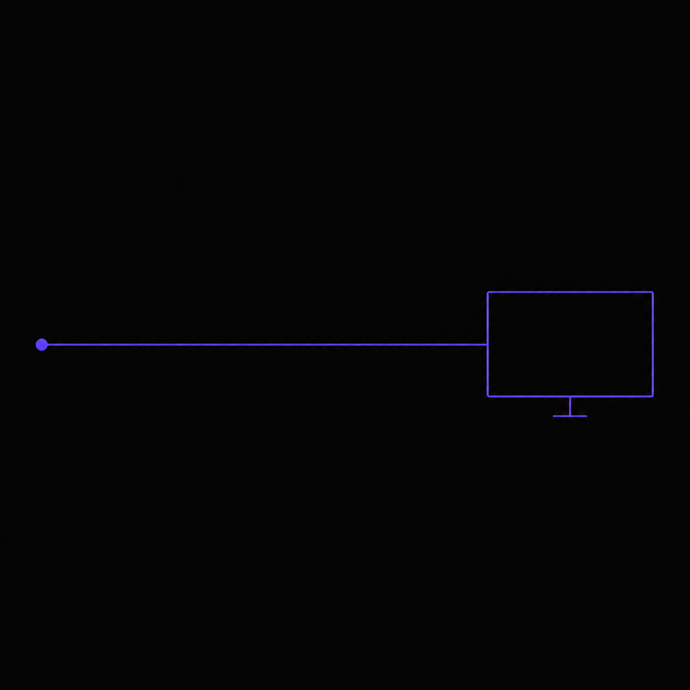

# 01 - Hello



The smallest Anthropify program. Streams a one-line answer from Claude.

## What it shows

- `anthropify.New(WithAnthropic(...))` builds a client.
- `CreateMessageStream` returns a stream of canonical Anthropic events.
- Iterating with `stream.Next()` and reading `evt.Delta.Text` is enough to render output.

## Run

```bash
set -a; source .env.e2e; set +a
go run ./examples/01-hello
```

Required env: `ANTHROPIC_API_KEY`. Optional: `ANTHROPIC_MODEL` (default `claude-sonnet-4-5`).

## Sample Output

```
Go's main strength is its simplicity combined with built-in concurrency support
(goroutines and channels) that makes it easy to write efficient, scalable
network services and distributed systems.
```

## Source

[`main.go`](./main.go) -- about 50 lines including imports.
