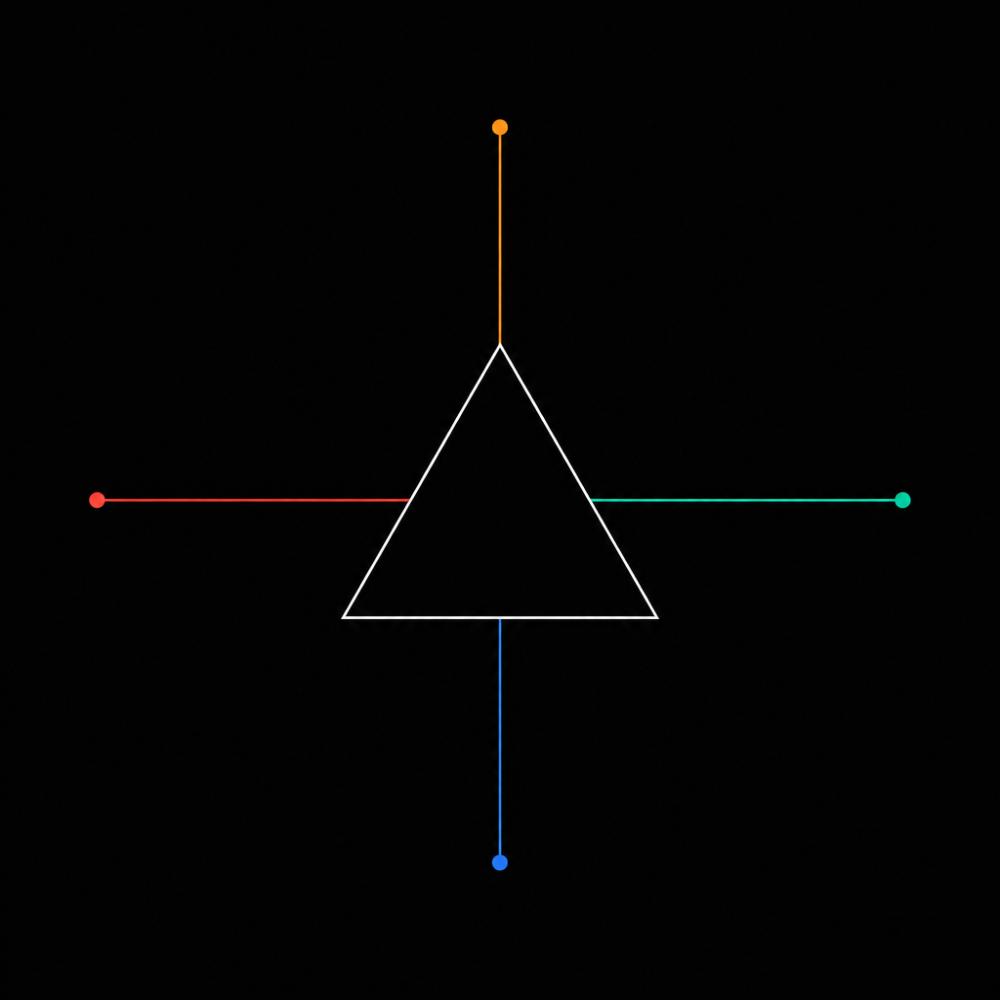

# 02 - Multi-Provider



One client, four providers, prefix routing. The application code is
identical across providers; only the model name changes.

## What it shows

- A single `anthropify.New(...)` registers four backends:
  - Anthropic (native)
  - Gemini (Vertex Express, native API)
  - Kimi (chat-completions compatible)
  - GLM (chat-completions compatible)
- `WithModelRoute("kimi-", ...)` and `WithModelRoute("glm-", ...)` tell
  the dispatcher which chat-completions backend serves a given prefix.
  Anthropic / OpenAI / Gemini are routed by their built-in prefixes.
- The same `CreateMessageStream` call is dispatched to a different
  upstream solely on the basis of `req.Model`.

## Run

```bash
set -a; source .env.e2e; set +a
go run ./examples/02-multi-provider
```

Required env: `ANTHROPIC_API_KEY`, `GEMINI_API_KEY`, `KIMI_API_KEY`,
`GLM_API_KEY`. Optional: `*_MODEL`, `KIMI_BASE_URL`, `GLM_BASE_URL`.

## Sample Output

```
--- claude-sonnet-4-5 ---
I was trained on data up through April 2024.

--- gemini-2.5-flash ---
My training data was last updated in early 2023.

--- kimi-k2-thinking ---
I was trained on data up to 2024.

--- glm-4.6 ---
I am continually learning and improving, so my model is regularly updated...
```

## Source

[`main.go`](./main.go)
