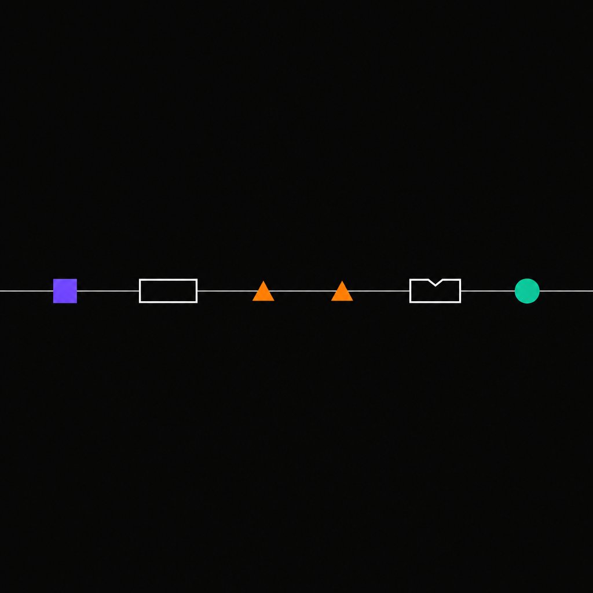

# 06 - Streaming Events



A guided tour of the six event types that flow over an Anthropic SSE
stream. Useful as a reference when you want to understand exactly what
Anthropify is delivering to your client code.

## What it shows

A single short request is streamed end to end and every event is
printed with its type and key fields, in order:

| # | Event | Carries |
|---|-------|---------|
| 1 | `message_start` | the `message.id`, `model`, `role` |
| 2 | `content_block_start` | block index, type (`text`, `thinking`, `tool_use`, ...) |
| 3 | `ping` (between blocks) | keep-alive only, no payload |
| 4 | `content_block_delta` | block index, delta type, partial content |
| 5 | `content_block_stop` | block index |
| 6 | `message_delta` | final `stop_reason`, cumulative `usage` |
| 7 | `message_stop` | end of stream |

## Run

```bash
set -a; source .env.e2e; set +a
go run ./examples/06-streaming-events
```

Required env: `ANTHROPIC_API_KEY`.

## Sample Output

```
 1  message_start         id=msg_01TcKvtgHPqqghSAx5N5ye8N model=claude-sonnet-4-5-20250929 role=assistant
 2  content_block_start   index=0 type=text
 3  ping                 (raw={"type": "ping"})
 4  content_block_delta   index=0 delta.type=text_delta text="streaming"
 5  content_block_delta   index=0 delta.type=text_delta text=" events demo"
 6  content_block_stop    index=0
 7  message_delta         stop_reason=end_turn output_tokens=6
 8  message_stop
```

Every other example in this directory observes the same vocabulary,
regardless of which provider produced the response.

## Source

[`main.go`](./main.go)
