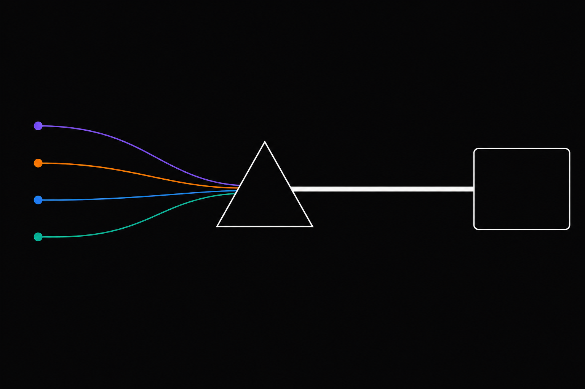

# Anthropify Examples



A tour of what Anthropify can do. Every example is a standalone Go
program that runs against real upstream APIs (no mocks).

## Index

| Example | What it shows |
|---|---|
| [01-hello](./01-hello) | Hello world. Smallest streaming call against Anthropic. |
| [02-multi-provider](./02-multi-provider) | One client, five providers, two protocols, route by model name. |
| [03-model-hot-switching](./03-model-hot-switching) | Switch providers mid-conversation; the context never resets. |
| [04-tool-use-portable](./04-tool-use-portable) | Define a tool once, invoke it across four providers. |
| [05-thinking-blocks](./05-thinking-blocks) | Canonical thinking events across providers. |
| [06-streaming-events](./06-streaming-events) | The Anthropic SSE event types, demystified. |
| [07-anthropic-compat](./07-anthropic-compat) | Protocol != vendor. Claude + MiniMax on one anthropic adapter. |

## Running locally

Each example reads provider keys from environment variables. The repo
ships `.env.e2e.example` as a template; copy it, fill in the keys you
have, then source it before running:

```bash
cp .env.e2e.example .env.e2e   # then edit and add your keys
set -a; source .env.e2e; set +a

go run ./examples/01-hello
```

Or via the Makefile:

```bash
make example-01   # 01-hello
make example-02   # 02-multi-provider
make example-03   # 03-model-hot-switching
make example-04   # 04-tool-use-portable
make example-05   # 05-thinking-blocks
make example-06   # 06-streaming-events
make example-07   # 07-anthropic-compat

make examples     # compile-check all of them
```

## Required keys per example

| Example | Anthropic | OpenAI | Gemini | Kimi | GLM | MiniMax |
|---------|:--:|:--:|:--:|:--:|:--:|:--:|
| 01-hello                  | x |   |   |   |   |   |
| 02-multi-provider         | x |   | x | x | x | x |
| 03-model-hot-switching    | x |   |   | x | x |   |
| 04-tool-use-portable      | x | x | x | x |   |   |
| 05-thinking-blocks        | x |   | x | x |   |   |
| 06-streaming-events       | x |   |   |   |   |   |
| 07-anthropic-compat       | x |   |   |   |   | x |
